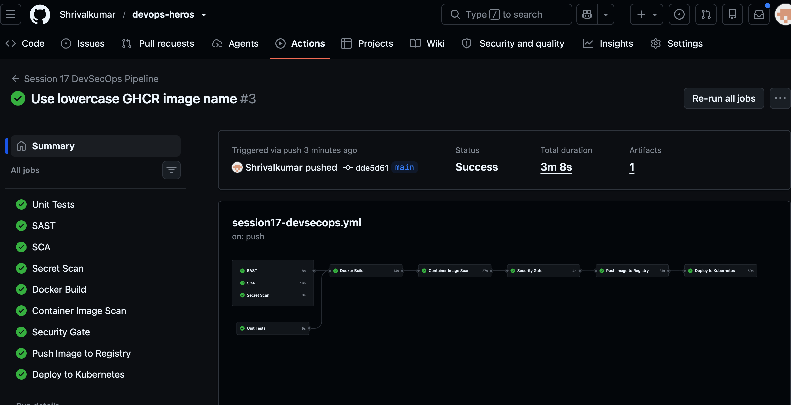

# Session 17 — CI/CD and DevSecOps

This is a small Flask dashboard used to demonstrate a CI/CD pipeline with security checks built in. The application has a health endpoint, a few calculator APIs, unit tests, a Dockerfile, and Kubernetes manifests.

## What the pipeline does

```text
Code → Unit tests → SAST → SCA → Secret scan → Docker build
     → Container scan → Security gate → Push to GHCR → Deploy to Kind
```

The GitHub Actions workflow is at [`.github/workflows/session17-devsecops.yml`](../../.github/workflows/session17-devsecops.yml). It runs from the repository root because GitHub only detects workflow files in that location.

| Stage | Tool / action | Purpose |
| --- | --- | --- |
| Unit tests | pytest | Checks Flask routes and calculator behaviour. |
| SAST | Bandit | Looks for risky patterns in Python source. |
| SCA | pip-audit | Checks Python dependencies for known vulnerabilities. |
| Secret scan | Gitleaks | Searches the repository history and files for exposed secrets. |
| Container scan | Trivy | Blocks the pipeline on unfixed critical image vulnerabilities. |
| Security gate | GitHub Actions `needs` | Allows publishing only after all security jobs pass. |
| Registry | GitHub Container Registry | Pushes an image tagged with the commit SHA and `latest`. |
| Kubernetes | Kind + kubectl | Creates a temporary cluster, deploys the image, and waits for rollout. |

## Project files

```text
demo/
├── app/                 Flask application and HTML template
├── tests/               pytest unit tests
├── Dockerfile           non-root Python 3.12 container image
├── bandit.yaml          SAST configuration
├── gitleaks.toml        secret scanner configuration
├── k8s/                 Deployment and Service manifests
├── requirements.txt     runtime dependencies
└── requirements-dev.txt test dependencies
```

## Run it locally

```bash
cd session-17-devsecops/demo
python3 -m venv .venv
source .venv/bin/activate
python -m pip install -r requirements-dev.txt
pytest -q
python app/app.py
```

The application listens on `http://localhost:5001`. A simple health check is available at `http://localhost:5001/health`.

Build the container locally:

```bash
docker build -t session17-devsecops:local .
docker run --rm -p 5001:5001 session17-devsecops:local
```

## Registry and Kubernetes notes

The workflow uses the automatic `GITHUB_TOKEN` with `packages: write`, so no Docker Hub password or AWS credential is needed. It pushes to:

```text
ghcr.io/Shrivalkumar/session17-devsecops:<commit-sha>
```

For every workflow run, the deploy job creates a short-lived Kind cluster inside the GitHub runner, loads the just-built image, applies `k8s/deployment.yaml` and `k8s/service.yaml`, then verifies the Deployment rollout. The cluster is intentionally temporary; this is a safe assignment demonstration of a real Kubernetes deployment step.

## Security gate

`security-gate` depends on SAST, SCA, secret scan, and container image scan. If any one of them fails, the image is not pushed and Kubernetes deployment does not start. The Trivy check blocks on unfixed critical vulnerabilities.

## Screenshot evidence

The pipeline completed successfully in GitHub Actions. The successful run shows every required job passing: tests, SAST, SCA, secret scan, Docker build, image scan, security gate, registry push, and Kubernetes deployment.


