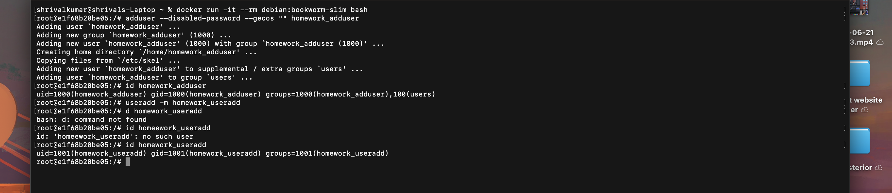

# Linux User Creation Commands

This terminal session demonstrates creating users with both `adduser` and `useradd` in a Debian Linux container.

The commands successfully created and verified:

- `homework_adduser` using `adduser`
- `homework_useradd` using `useradd -m`
