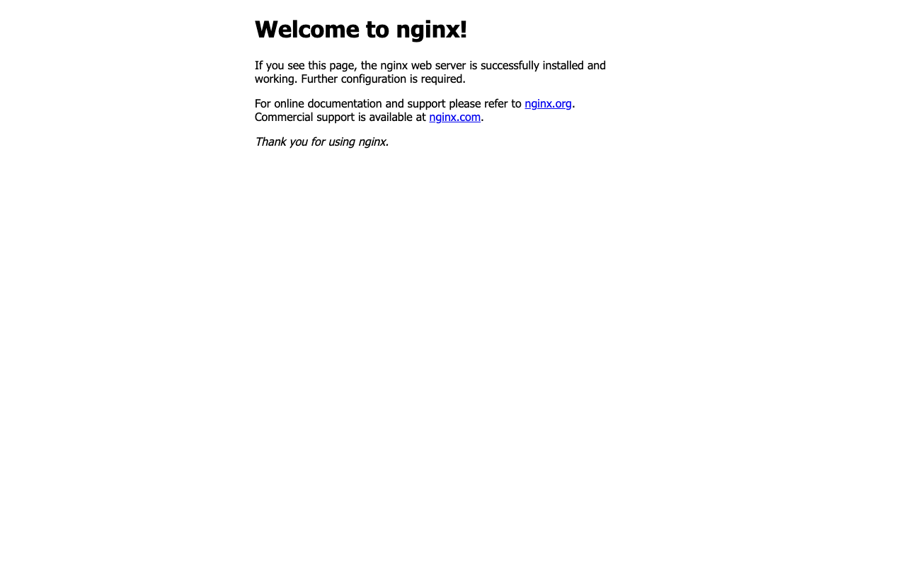

# Kubernetes Pods, ReplicaSets & Deployments

## Task

I created a Pod, ReplicaSet, Deployment, and NodePort Service using Kubernetes manifests.

## Files

```text
manifests/pod.yml
manifests/replicaset.yml
manifests/deployment.yml
manifests/service.yml
```

## Commands I ran

Run these commands from the `manifests` folder:

```bash
kubectl apply -f pod.yml -f replicaset.yml -f deployment.yml -f service.yml
kubectl wait --for=condition=Ready pod -l app=nginx --timeout=120s
kubectl get pods -l app=nginx -o wide
kubectl get rs
kubectl get deployment nginx-deployment
kubectl get svc nginx-service
kubectl port-forward service/nginx-service 18080:80 --address 127.0.0.1
```

## Output

```text
NAME                                READY   STATUS    RESTARTS   AGE   IP            NODE
nginx-deployment-6946987795-4rzjp   1/1     Running   0          6s    10.244.0.11   devops-assignment-control-plane
nginx-deployment-6946987795-7mpjf   1/1     Running   0          6s    10.244.0.9    devops-assignment-control-plane
nginx-deployment-6946987795-lqw54   1/1     Running   0          6s    10.244.0.10   devops-assignment-control-plane
nginx-pod                           1/1     Running   0          6s    10.244.0.6    devops-assignment-control-plane
nginx-rs-8msbp                      1/1     Running   0          6s    10.244.0.8    devops-assignment-control-plane
nginx-rs-clsmq                      1/1     Running   0          6s    10.244.0.7    devops-assignment-control-plane

NAME                          DESIRED   CURRENT   READY   AGE
nginx-deployment-6946987795   3         3         3       6s
nginx-rs                      3         3         3       6s

NAME               READY   UP-TO-DATE   AVAILABLE   AGE
nginx-deployment   3/3     3            3           6s

NAME            TYPE       CLUSTER-IP     EXTERNAL-IP   PORT(S)        AGE
nginx-service   NodePort   10.96.87.219   <none>        80:30080/TCP   6s
```

## Screenshot



## What I understood

A Pod runs a container. A ReplicaSet keeps replicas running. A Deployment manages updates and rollouts.