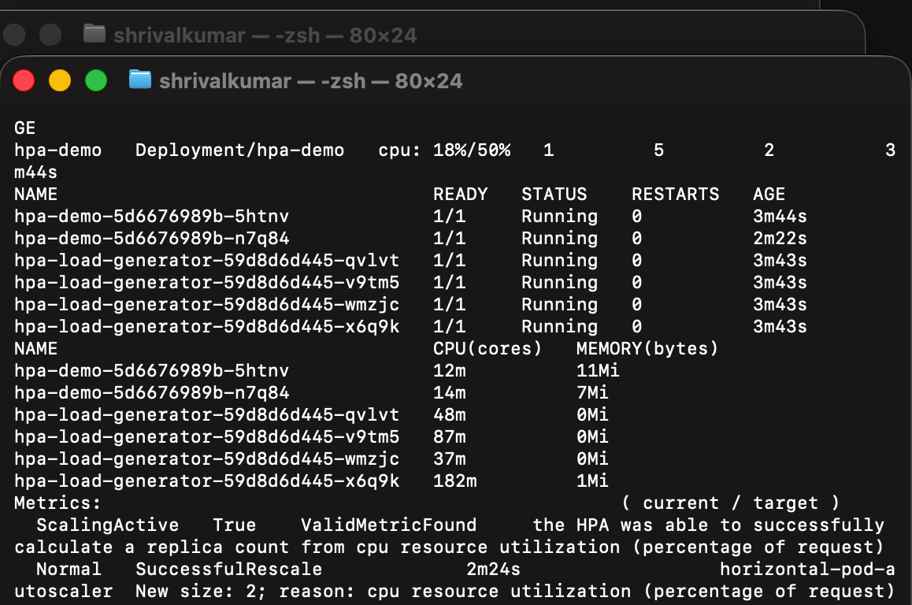
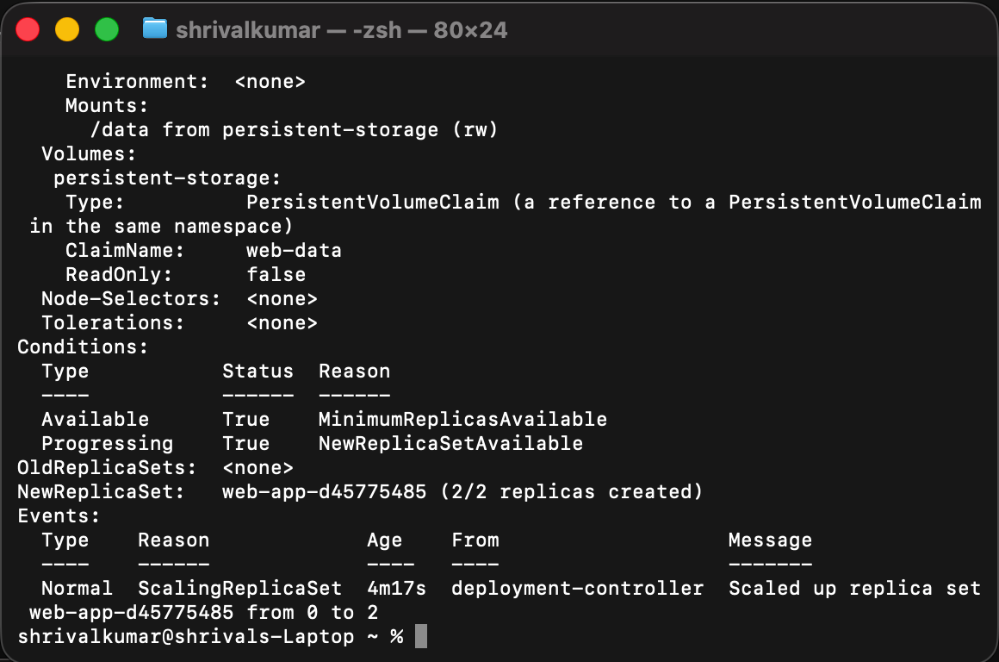

# Session 13 - Kubernetes Storage, HPA, and Probes

I completed this session with a temporary Kind cluster so I could test storage, health probes, and autoscaling without keeping cloud resources running.

## What is included

- [Volume notes](01-kubernetes-volumes/README.md), plus practical emptyDir, hostPath, PV, PVC, and StorageClass manifests.
- hpa/ with the HPA target, Service, and four-replica load generator.
- 05-probes/ with liveness, readiness, and startup probe examples.
- mini-project/ with a namespace, nginx Deployment, PVC, Service, HPA, resource requests/limits, and all three probes.

## HPA hands-on

I installed metrics-server in Kind, applied the HPA demo, then applied the load generator. The HPA uses CPU utilization with a 50% target and can scale the nginx Deployment from one to five replicas.

~~~bash
kubectl apply -f 04-hpa/deployment.yaml
kubectl apply -f hpa/hpa-demo-service.yaml
kubectl apply -f 04-hpa/hpa.yaml
kubectl apply -f hpa/load-generator.yaml
kubectl get hpa
kubectl get pods
kubectl top pods
kubectl describe hpa hpa-demo
~~~

## Mini project

~~~bash
kubectl apply -f mini-project/namespace.yaml
kubectl apply -f mini-project/pvc.yaml
kubectl apply -f mini-project/deployment.yaml
kubectl apply -f mini-project/service.yaml
kubectl apply -f mini-project/hpa.yaml
kubectl -n production-webapp get deploy,pods,svc,pvc,hpa
~~~

The web application mounts its dynamically provisioned web-data claim at /data. Startup, readiness, and liveness probes protect the application lifecycle, and the HPA is based on its CPU request.

## Screenshots

I captured the running HPA, workload Pods, and actual CPU metrics after applying the load generator.

I captured the mini project's ready Pods, bound PVC, Service, and HPA.

## Cleanup

~~~bash
kubectl delete -f hpa/load-generator.yaml --ignore-not-found
kubectl delete -f hpa/hpa-demo-service.yaml --ignore-not-found
kubectl delete -f 04-hpa/hpa.yaml --ignore-not-found
kubectl delete -f 04-hpa/deployment.yaml --ignore-not-found
kubectl delete namespace production-webapp --ignore-not-found
kind delete cluster --name session13
~~~
