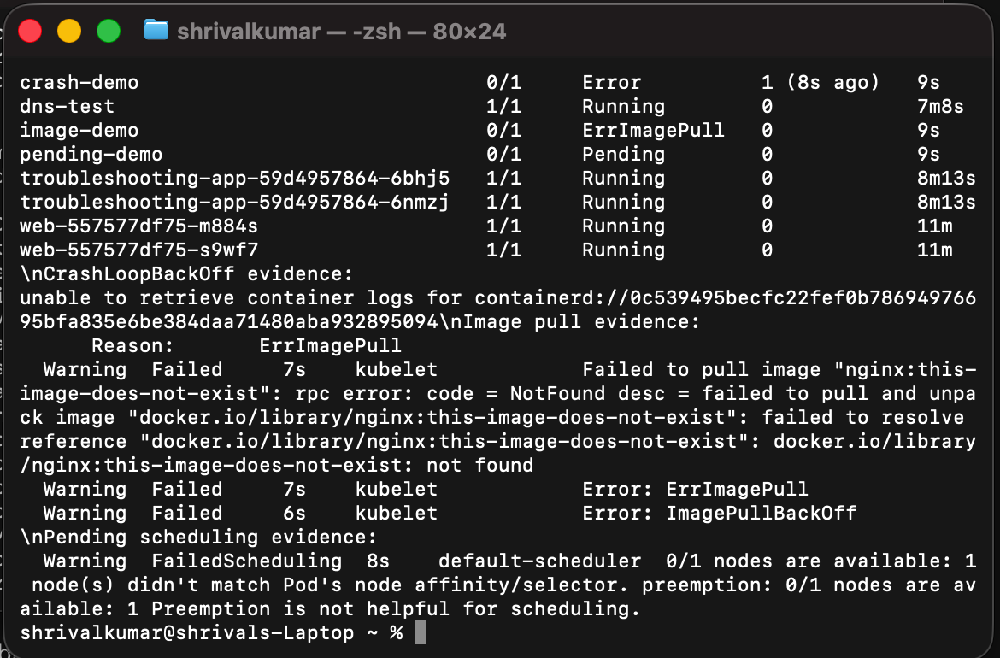
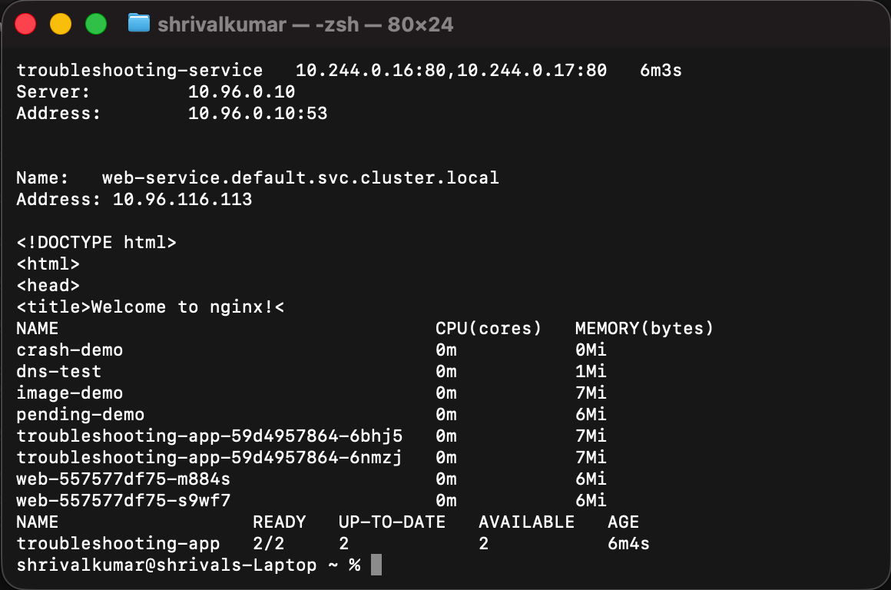

# Session 14 - Kubernetes Troubleshooting

I used a temporary Kind cluster to reproduce each failure, inspect it with kubectl, apply the correction, and verify the workload afterwards.

## Commands I practised

| Command | What I used it for |
|---|---|
| kubectl get / get -o wide | Quick state, node, IP, and restart count checks. |
| kubectl describe | Events, scheduling decisions, image pull messages, probes, and volume details. |
| kubectl logs | Application failure output and the previous CrashLoop attempt. |
| kubectl exec | DNS lookup and HTTP connectivity from inside a debug Pod. |
| kubectl get events | Ordered Kubernetes control-plane events. |
| kubectl explain | Confirming manifest fields before changing them. |
| kubectl top | Pod CPU and memory metrics after metrics-server was installed. |

## Troubleshooting results

| Issue | Root cause | Fix and verification |
|---|---|---|
| CrashLoopBackOff | The BusyBox command exited with status 1. | I checked logs and previous logs, changed the command to sleep, then confirmed Running. |
| ErrImagePull / ImagePullBackOff | A non-existent Nginx image tag was requested. | I used describe events to identify the tag, changed it to nginx:1.27, and confirmed Running. |
| Pending | The Pod selected a node name that does not exist. | I checked scheduling events, removed the nodeSelector, and confirmed scheduling. |
| ContainerCreating | A newly scheduled Pod was still pulling its image and creating its sandbox. | I used `kubectl describe pod` to distinguish normal image-pull progress from an actual failure, then waited for `Ready`. |
| Service connectivity | The Service selector did not match the web Deployment labels, so it had no endpoints. | I changed the selector to app: web, checked Endpoints, then used DNS and wget from the dns-test Pod. |
| DNS | DNS resolved the Service name; the initial request failed because the Service had zero endpoints, not because CoreDNS was broken. | I verified the name resolved before and after fixing the selector. |
| Pod networking | I checked Pod IPs with `get pods -o wide`, Service endpoints, and an HTTP request from another Pod. | The test succeeded after the selector correction, which isolated the fault to Service configuration rather than CNI networking. |
| Configuration | The mini-project Pod used a made-up image tag. | I read the image-pull event, deployed the working Deployment and Service, and verified two ready Pods. |

## Evidence

This terminal capture records the live failure evidence: a crashing container, `ErrImagePull` / `ImagePullBackOff`, and the node-selector scheduling error. I then reapplied the fixed manifests and confirmed all three Pods were `Running`.

This capture shows populated Service endpoints, DNS lookup, an in-cluster HTTP request, live resource metrics, and the mini-project's healthy Deployment.

## Mini project

The mini project starts from its broken-image Pod. I used describe to identify the bad tag, then deployed `troubleshooting-app` and `troubleshooting-service`. The result was a two-replica nginx service with ready Pods.

## Cleanup

~~~bash
kind delete cluster --name session14
~~~
