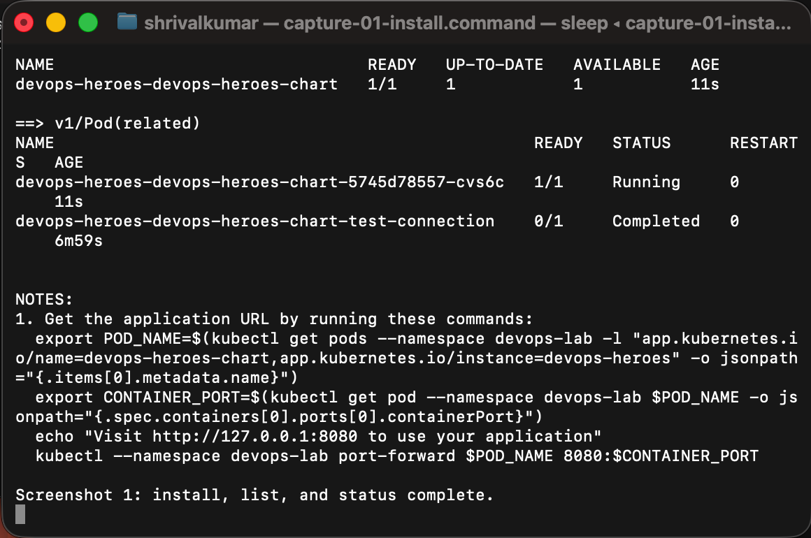
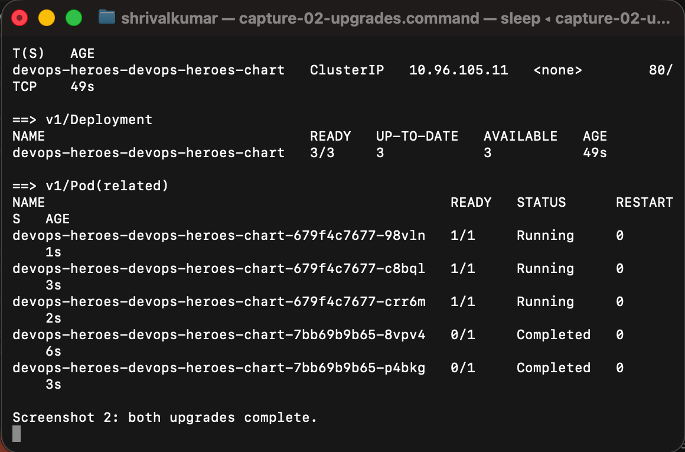
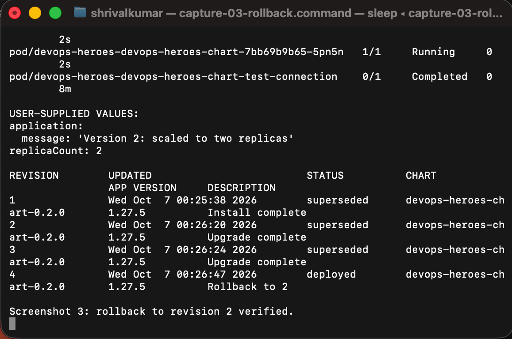

# Session 15 — Helm

## Objective

Practise the core Helm commands and deploy a small, versioned Kubernetes application. The work was run against a local **Kind** cluster (`helm-lab`), so AWS credentials were not required.

## Mini project: DevOps Heroes

`devops-heroes-chart/` deploys an NGINX site whose title and message come from `values.yaml`. It contains:

- `Chart.yaml` — chart metadata (version `0.2.0`)
- `values.yaml` — image, replica count, service, and page-content settings
- `templates/deployment.yaml` — Deployment, probes, ConfigMap checksum rollout, and volume mount
- `templates/service.yaml` — ClusterIP Service
- `templates/configmap.yaml` — the application HTML
- `templates/serviceaccount.yaml`, `_helpers.tpl`, `NOTES.txt`, and `tests/` — standard Helm support templates

The checksum annotation is intentional: it makes a ConfigMap content change roll out new Pods, including when the file is mounted with `subPath`.

## Prerequisites

```bash
helm version
kubectl version --client
kind create cluster --name helm-lab
```

## Task 1 — Helm command practice

All commands below were executed successfully from the repository root. `-n devops-lab` is short for `--namespace devops-lab`.

| Command | What it does | Result observed |
| --- | --- | --- |
| `helm create session15-/devops-heroes-chart` | Generates a starter chart. | Created `Chart.yaml`, `values.yaml`, and template files. |
| `helm lint session15-/devops-heroes-chart` | Validates chart structure and rendered YAML. | `0 chart(s) failed`. |
| `helm install devops-heroes ./session15-/devops-heroes-chart -n devops-lab --create-namespace --wait` | Installs the chart as a release and waits for ready resources. | Release deployed as revision 1. |
| `helm list -n devops-lab` | Lists releases in a namespace. | Listed `devops-heroes` as `deployed`. |
| `helm status devops-heroes -n devops-lab` | Shows release state and managed resources. | Deployment, Pods, Service, ServiceAccount, and ConfigMap were healthy. |
| `helm get values devops-heroes -n devops-lab --all` | Retrieves the calculated values for a release. | Showed the NGINX image and app settings. |
| `helm get manifest devops-heroes -n devops-lab` | Retrieves Helm-rendered Kubernetes YAML. | Showed the generated ServiceAccount, ConfigMap, Service, and Deployment. |
| `helm upgrade devops-heroes ./session15-/devops-heroes-chart -n devops-lab --set replicaCount=2 --wait` | Applies a new revision using changed values. | Revision 2 deployed with two replicas. |
| `helm history devops-heroes -n devops-lab` | Displays prior release revisions. | Showed install, upgrades, and rollback revisions. |
| `helm rollback devops-heroes 2 -n devops-lab --wait` | Restores the release to a chosen previous revision. | New revision 4 restored revision 2's configuration. |
| `helm uninstall devops-heroes -n devops-lab` | Removes the release and its managed resources. | Release removed; `helm list` was empty and no Deployments remained. |
| `helm repo add bitnami https://charts.bitnami.com/bitnami` / `helm repo update` / `helm repo list` | Adds, refreshes, and lists a chart repository. | `bitnami` was added and refreshed. |
| `helm search repo nginx` | Searches configured repositories. | Returned `bitnami/nginx` and related charts. |

Repository search output:

```text
NAME                             CHART VERSION  APP VERSION  DESCRIPTION
bitnami/nginx                    25.2.1         1.31.6       NGINX Open Source is a web server...
bitnami/nginx-ingress-controller 12.0.7         1.13.1       NGINX Ingress Controller is...
```

## Task 2 — Complete rollback workflow

```text
Install (revision 1)
   ↓
Upgrade to 2 replicas and “Version 2” content (revision 2)
   ↓
Verify deployment and rendered page
   ↓
Upgrade to 3 replicas and “Version 3” content (revision 3)
   ↓
Verify deployment and rendered page
   ↓
Rollback to revision 2 (new revision 4)
   ↓
Verify 2 replicas and “Version 2” content
```

### Installation and status



`helm install` returned `STATUS: deployed`, and `helm status` showed one ready replica.

### Upgrades verified



The first upgrade scaled the Deployment to `2/2` and changed the served page to Version 2. The second upgrade scaled it to `3/3` and served Version 3.

### Rollback verified



The rollback command targeted revision 2. Helm recorded it as revision 4, and both the Deployment (`2/2`) and the served HTML returned to Version 2.

The exact validation commands were:

```bash
kubectl get deploy,pods -n devops-lab
kubectl exec -n devops-lab deploy/devops-heroes-devops-heroes-chart \
  -- cat /usr/share/nginx/html/index.html
helm history devops-heroes -n devops-lab
```

Observed history:

```text
REVISION  STATUS      DESCRIPTION
1         superseded  Install complete
2         superseded  Upgrade complete
3         superseded  Upgrade complete
4         deployed    Rollback to 2
```

## Re-run instructions

```bash
# Validate and install
helm lint session15-/devops-heroes-chart
helm install devops-heroes ./session15-/devops-heroes-chart -n devops-lab --create-namespace --wait

# Upgrade twice
helm upgrade devops-heroes ./session15-/devops-heroes-chart -n devops-lab \
  --set replicaCount=2 --set-string 'application.message=Version 2: scaled to two replicas' --wait
helm upgrade devops-heroes ./session15-/devops-heroes-chart -n devops-lab \
  --set replicaCount=3 --set-string 'application.message=Version 3: second upgrade complete' --wait

# Restore revision 2, inspect it, then clean up
helm rollback devops-heroes 2 -n devops-lab --wait
helm status devops-heroes -n devops-lab
helm uninstall devops-heroes -n devops-lab
```

## Final cleanup evidence

```text
release "devops-heroes" uninstalled

$ helm list --namespace devops-lab
NAME  NAMESPACE  REVISION  UPDATED  STATUS  CHART  APP VERSION

$ kubectl get deploy -n devops-lab
No resources found in devops-lab namespace.
```
