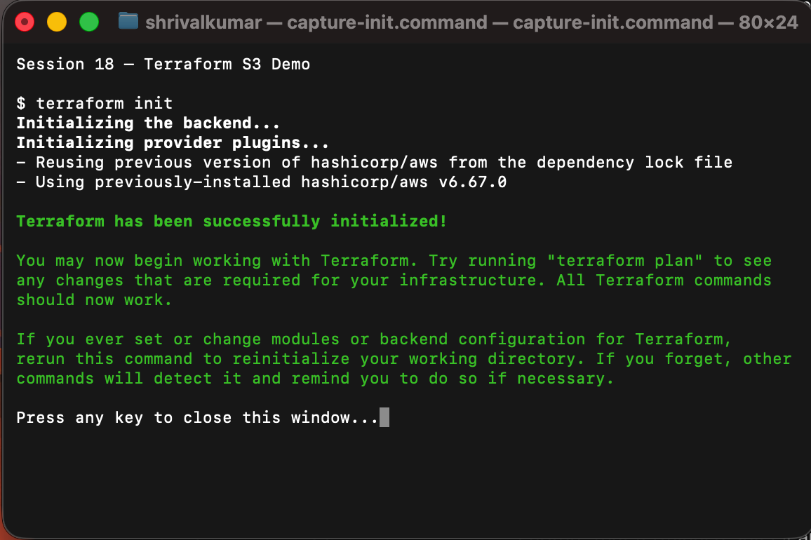
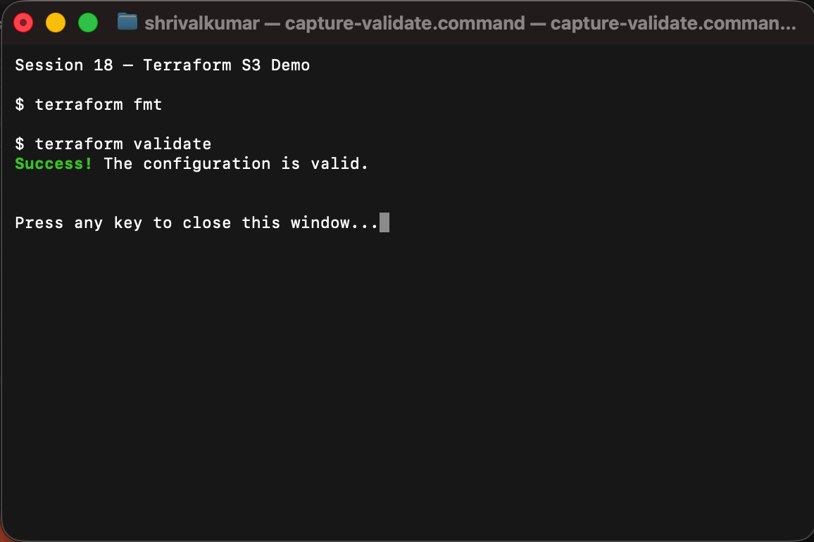
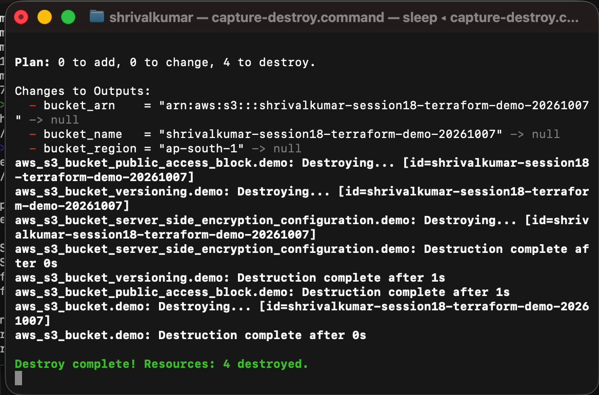
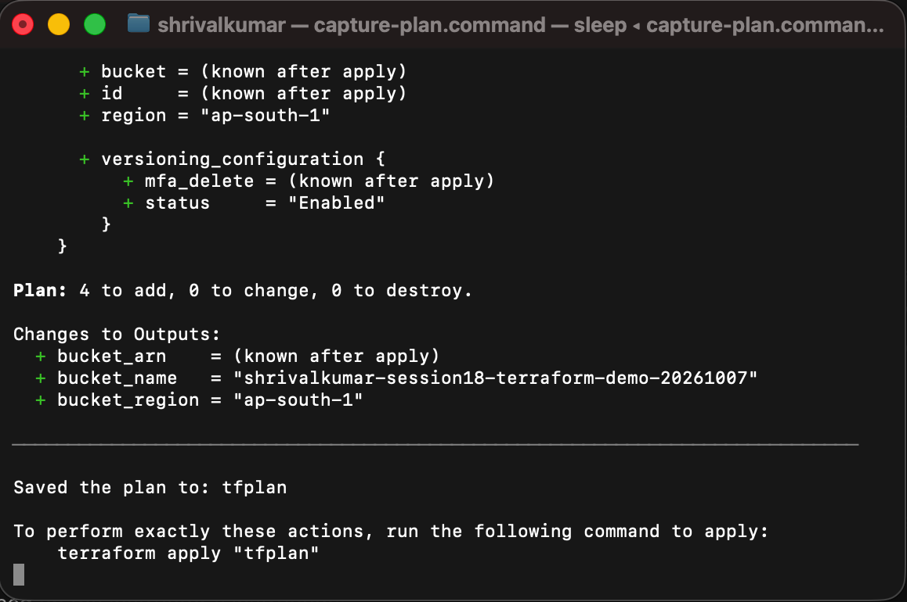
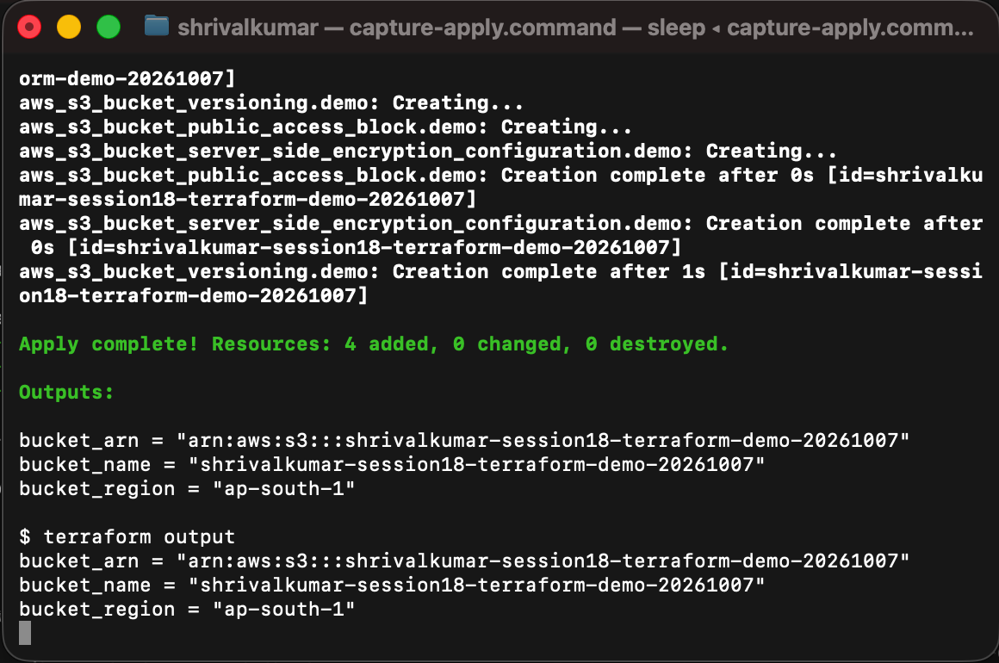
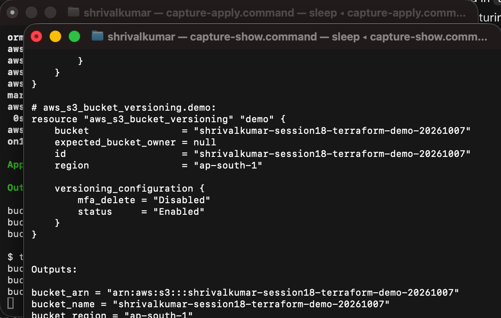

# Terraform S3 Demo

This small project creates one private AWS S3 bucket in `ap-south-1`. It is deliberately simple, but the bucket is set up with versioning, server-side encryption, and public-access blocking so the example follows sensible defaults.

## Project files

```text
terraform-s3-demo/
├── main.tf             # S3 bucket and its settings
├── provider.tf         # AWS provider configuration
├── variables.tf        # Reusable input variables
├── outputs.tf          # Bucket details printed after apply
├── terraform.tf        # Terraform and provider version requirements
├── terraform.tfvars    # Values used for this demo
└── README.md
```

## What Terraform will create

| Resource | Reason |
| --- | --- |
| `aws_s3_bucket.demo` | The demo bucket itself |
| `aws_s3_bucket_versioning.demo` | Keeps older object versions available |
| `aws_s3_bucket_server_side_encryption_configuration.demo` | Encrypts new objects with SSE-S3 (`AES256`) |
| `aws_s3_bucket_public_access_block.demo` | Prevents accidental public exposure |

The bucket name in `terraform.tfvars` must be globally unique. Change `bucket_name` before running the project if AWS reports that the name is already in use.

## Prerequisites

Install Terraform and the AWS CLI, then authenticate with an IAM user or role that has permission to manage this temporary S3 bucket.

```bash
aws configure
aws sts get-caller-identity
```

The second command should print the AWS account and ARN that Terraform will use. Do not put access keys in `terraform.tfvars` or commit them to Git.

For this workstation, Terraform is run from the official Docker image because a local Terraform binary is not installed:

```bash
alias terraform='docker run --rm --user "$(id -u):$(id -g)" -v "$PWD":/workspace -v "/Users/shrivalkumar/.aws":/tmp/aws:ro -e AWS_SHARED_CREDENTIALS_FILE=/tmp/aws/credentials -e AWS_CONFIG_FILE=/tmp/aws/config -w /workspace hashicorp/terraform:1.12.2'
```

If Terraform is installed locally, use the normal `terraform` commands below instead.

## Complete workflow

Run these commands from this directory.

### 1. Initialise

```bash
terraform init
```

Downloads the AWS provider and creates the local `.terraform` working directory. The lock file records the selected provider version.

### 2. Format and validate

```bash
terraform fmt
terraform validate
```

`fmt` makes the HCL style consistent. `validate` checks configuration syntax and internal references without creating anything in AWS.

### 3. Review the execution plan

```bash
terraform plan -out=tfplan
```

This compares the configuration with Terraform state and displays the resources to be added. Read the plan carefully before continuing.

### 4. Create the bucket

```bash
terraform apply tfplan
```

Terraform creates the S3 bucket and its three supporting configurations, then saves their identifiers in `terraform.tfstate`.

### 5. Inspect the result

```bash
terraform show
terraform output
terraform output bucket_name
```

`show` displays the tracked infrastructure. `output` prints the bucket name, ARN, and region declared in `outputs.tf`.

An additional AWS-side check is useful:

```bash
aws s3api head-bucket --bucket "$(terraform output -raw bucket_name)"
```

### 6. Clean up

```bash
terraform destroy
```

Type `yes` at the confirmation prompt. The bucket must be empty for S3 to delete it; this demo does not upload objects, so the normal cleanup completes without extra work.

## Command record

| Command | Purpose | Result |
| --- | --- | --- |
| `terraform init` | Installs the AWS provider | Run locally; successful |
| `terraform fmt` | Formats Terraform files | Run locally; successful |
| `terraform validate` | Validates the configuration | Run locally; successful |
| `terraform plan -out=tfplan` | Previews the AWS changes | Successful: 4 resources to add |
| `terraform apply tfplan` | Creates the S3 bucket | Successful: 4 resources added |
| `terraform show` | Displays managed resources | Successful: bucket protections and outputs verified |
| `terraform output` | Prints output values | Successful: name, ARN, and region returned |
| `terraform destroy` | Deletes the demo resources | Successful: 4 resources destroyed |

## Screenshots


### Initialise, format, and validate



### Format and validate



### Destroy workflow



### Plan



### Apply and output



### Show



## Execution result

The complete lifecycle was run against AWS using the configured IAM user: plan, apply, show, output, and destroy. Terraform created the bucket `shrivalkumar-session18-terraform-demo-20261007` in `ap-south-1`, verified encryption, versioning, and public-access protection, and then removed all four managed resources. A final AWS check confirmed that the bucket was no longer accessible.

## Notes on state

`terraform.tfstate` contains the IDs and metadata Terraform needs for future updates and destroy operations. It is intentionally local for this assignment. In a shared or production project, store state remotely (for example, an encrypted S3 backend with state locking) and do not commit it to Git.
