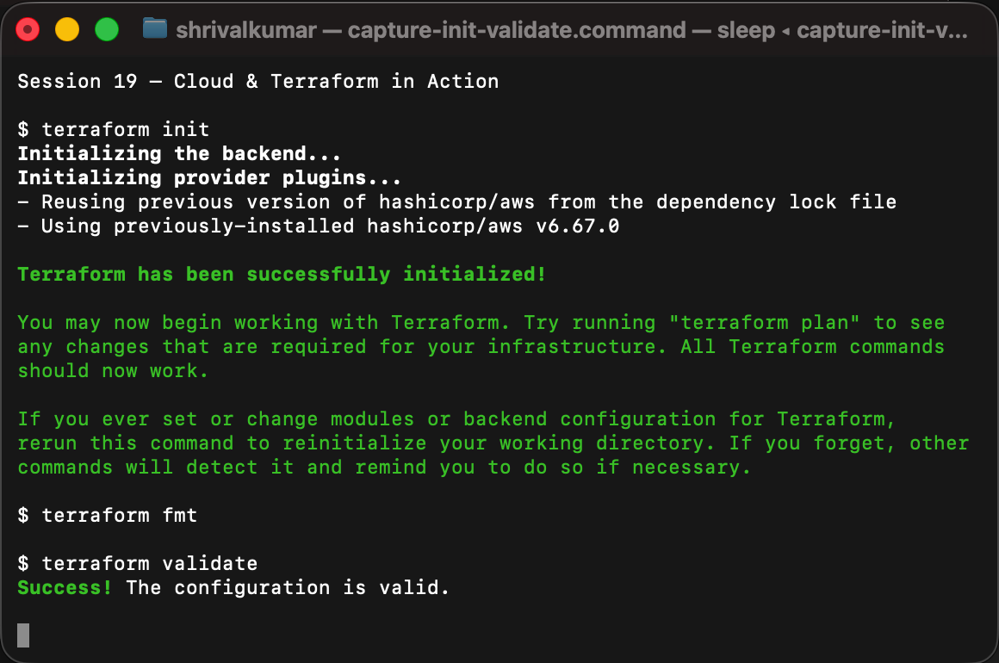
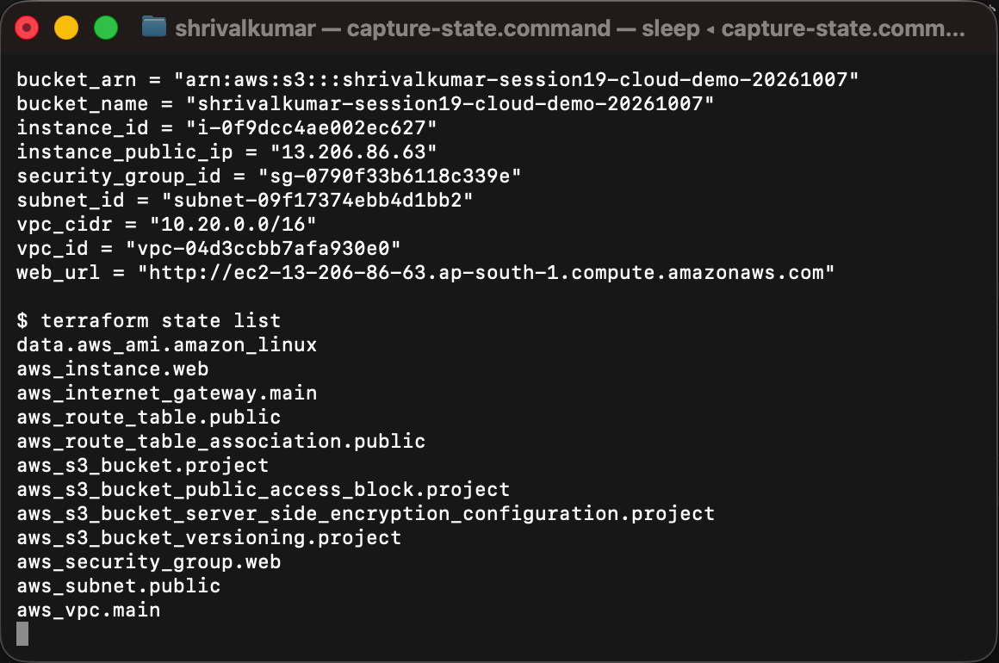
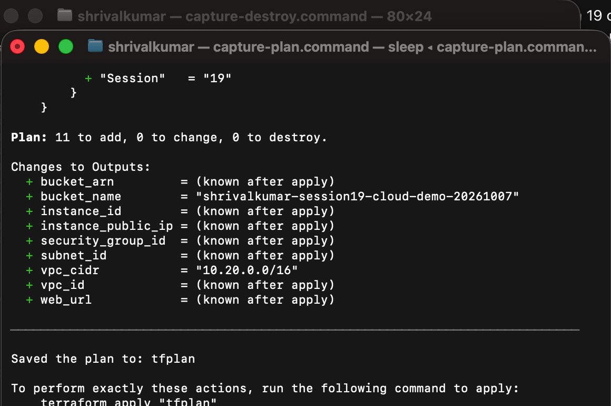
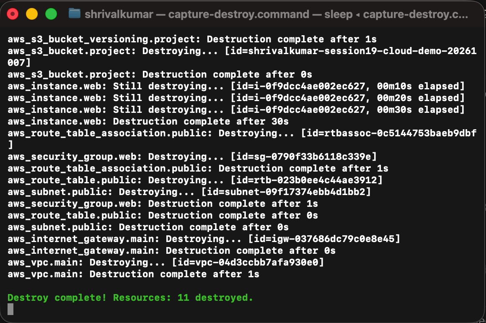

# Session 19 — Cloud & Terraform in Action

This project builds a small public web environment in AWS with Terraform. It is designed as a short-lived learning environment: create it, inspect it, and destroy it after the demonstration.

## Architecture

```text
                                  Internet
                                     |
                              Internet Gateway
                                     |
┌──────────────────────── VPC: 10.20.0.0/16 ────────────────────────┐
│                                                                    │
│  Public route table ─────── 0.0.0.0/0 → Internet Gateway          │
│          |                                                         │
│          v                                                         │
│  Public subnet: 10.20.1.0/24                                      │
│          |                                                         │
│          +── Security group: HTTP/HTTPS in, all outbound          │
│                  |                                                 │
│                  v                                                 │
│            EC2 t3.micro running Nginx                             │
│                                                                    │
└────────────────────────────────────────────────────────────────────┘

Private S3 bucket (versioning + SSE-S3 encryption + public access block)
```

## Files

```text
08-mini-project/
├── versions.tf             # Terraform and AWS provider requirements
├── variables.tf            # Region, instance type, and bucket name inputs
├── terraform.tfvars        # Project-specific values
├── main.tf                 # VPC, subnet, IGW, routes, security group, EC2, S3
├── outputs.tf              # IDs, web URL, and bucket details
├── terraform.tfstate       # Created locally by Terraform; ignored by Git
└── screenshots/            # Real terminal captures from the completed run
```

## Terraform concepts demonstrated

| Concept | Where it is used |
| --- | --- |
| Provider | AWS provider in `versions.tf` |
| Variables | `aws_region`, `instance_type`, and `bucket_name` |
| Resources | VPC, subnet, internet gateway, route table, security group, EC2, S3 |
| Outputs | Network IDs, public IP, URL, and bucket details |
| Dependencies | Terraform derives most relationships from resource references; EC2 explicitly waits for the public route association |
| State | Local `terraform.tfstate` records the AWS resource IDs required for updates and destruction |

## Security choices

- SSH is not open to the internet. The example only opens ports 80 and 443.
- The instance uses the current Amazon Linux 2023 AMI from the official Amazon owner.
- The S3 bucket is private, versioned, encrypted with SSE-S3 (`AES256`), and protected from public access.
- The EC2 instance type is `t3.micro` to keep the temporary demonstration small.

## Prerequisites

1. Terraform and AWS CLI installed, or use the Docker wrapper below.
2. An authenticated local AWS profile.
3. The IAM principal needs S3 permission and EC2/VPC permission. `AmazonEC2FullAccess` and `AmazonS3FullAccess` are sufficient for this short lab; use a narrower custom policy in a real project.

Verify the active identity without displaying credentials:

```bash
aws sts get-caller-identity
```

On this workstation Terraform runs in Docker:

```bash
alias terraform='docker run --rm --user "$(id -u):$(id -g)" -v "$PWD":/workspace -v "/Users/shrivalkumar/.aws":/tmp/aws:ro -e AWS_SHARED_CREDENTIALS_FILE=/tmp/aws/credentials -e AWS_CONFIG_FILE=/tmp/aws/config -w /workspace hashicorp/terraform:1.12.2'
```

## Runbook

Run each command from `08-mini-project/`.

### Initialise, format, and validate

```bash
terraform init
terraform fmt
terraform validate
```

`init` downloads the AWS provider, `fmt` standardises Terraform formatting, and `validate` checks the configuration before contacting AWS to create resources.

### Plan

```bash
terraform plan -out=tfplan
```

The plan shows eleven resources: VPC, subnet, internet gateway, route table, route association, security group, EC2 instance, S3 bucket, S3 versioning, S3 encryption, and S3 public-access protection. Review it before applying.

### Apply

```bash
terraform apply tfplan
```

Terraform stores the created resource IDs in `terraform.tfstate`.

### Inspect

```bash
terraform show
terraform output
terraform state list
```

Use the returned `web_url` after the instance bootstraps. Nginx installation can take a minute or two after `apply` finishes.

### Destroy

```bash
terraform destroy
```

Confirm with `yes`. This removes all resources in dependency order and avoids leaving an instance, elastic networking components, or storage behind.

## Command record

| Command | What it checked or changed | Live result |
| --- | --- | --- |
| `terraform init` | Installed the locked AWS provider | Successful |
| `terraform fmt` | Formatted the HCL files | Successful |
| `terraform validate` | Checked the Terraform configuration | Successful |
| `terraform plan -out=tfplan` | Previewed AWS changes | 11 resources to add |
| `terraform apply tfplan` | Created the infrastructure | 11 resources added |
| `terraform output` | Returned IDs, public IP, URL, and bucket details | Successful |
| `terraform state list` | Listed managed resources in the local state | VPC, EC2, S3, network, and data source present |
| `terraform destroy` | Removed the learning environment | 11 resources destroyed |

## Expected outputs

```text
bucket_arn         = "arn:aws:s3:::..."
bucket_name        = "..."
instance_id        = "i-..."
instance_public_ip = "..."
security_group_id  = "sg-..."
subnet_id          = "subnet-..."
vpc_id             = "vpc-..."
web_url            = "http://ec2-...amazonaws.com"
```

## Screenshots

All captures below are real, tightly cropped terminal screenshots from the live AWS run. No credentials are shown.

### Initialise, format, and validate



### Apply outputs and state



### Plan



### Destroy



## Live execution result

Terraform successfully created the full 11-resource stack in `ap-south-1`: a VPC, public subnet, internet gateway, route table and association, web security group, Amazon Linux EC2 instance, plus a private S3 bucket with versioning, encryption, and public-access blocking. The Nginx page returned `Session 19 Terraform web server` over HTTP. After verification, `terraform destroy` removed all 11 managed resources.

## Cleanup note

This is not production infrastructure. Always run `terraform destroy` after recording the results; the Terraform state is left locally only as the record of that completed lifecycle and is ignored by Git.
