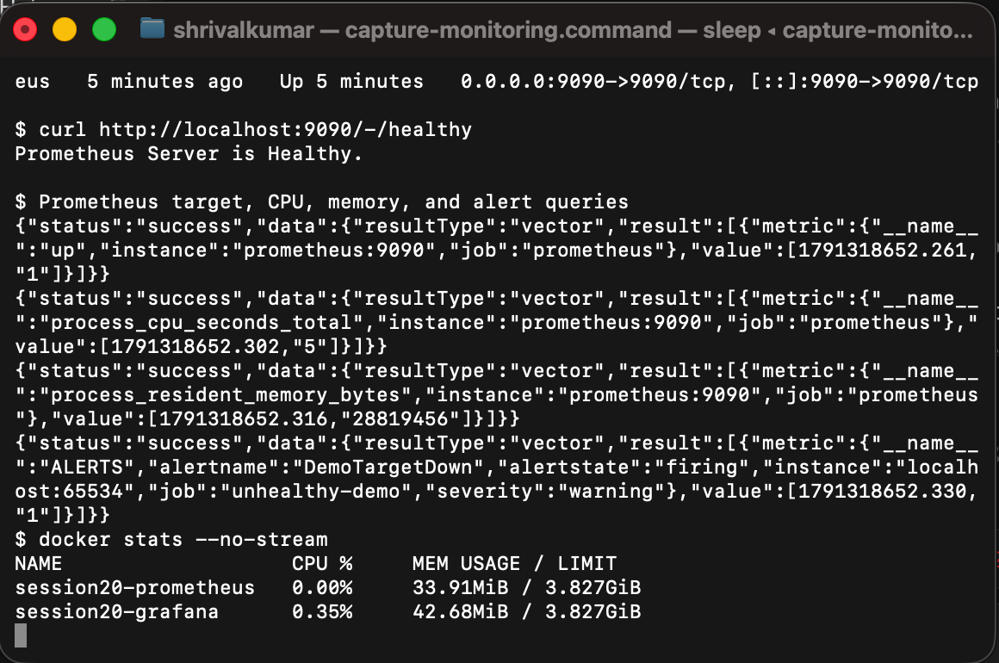

# Monitoring Demo

This Docker Compose demo starts Prometheus and Grafana. Prometheus scrapes itself every five seconds and intentionally includes one unavailable target so the alerting rule can be observed in a firing state.

## Start

```bash
docker compose up -d
docker compose ps
```

Prometheus is available at `http://localhost:9090` and Grafana at `http://localhost:3000` (default first login: `admin` / `admin`).

## What was observed

| Signal | Command or query | Meaning |
| --- | --- | --- |
| Target health | `up{job="prometheus"}` | `1` means the Prometheus target is reachable |
| CPU | `process_cpu_seconds_total` | CPU time consumed by the Prometheus process |
| Memory | `process_resident_memory_bytes` | Resident memory used by the Prometheus process |
| Alert | `ALERTS{alertname="DemoTargetDown"}` | Demonstrates a firing warning after the target stays down for ten seconds |
| Service health | `curl http://localhost:9090/-/healthy` | Prometheus health endpoint response |
| Logs | `docker compose logs --tail 20 prometheus` | Prometheus operational events |

The unavailable target is deliberately artificial and exists only for the alerting exercise. In a real system, an alert would notify a person or incident-management integration such as Alertmanager, Slack, or PagerDuty.

## Live run evidence

The running Prometheus target returned `up = 1` and the `/-/healthy` endpoint returned healthy. The run also captured process CPU time, resident memory, Docker CPU/memory use, and the firing `DemoTargetDown` alert.



## Stop

```bash
docker compose down
```
