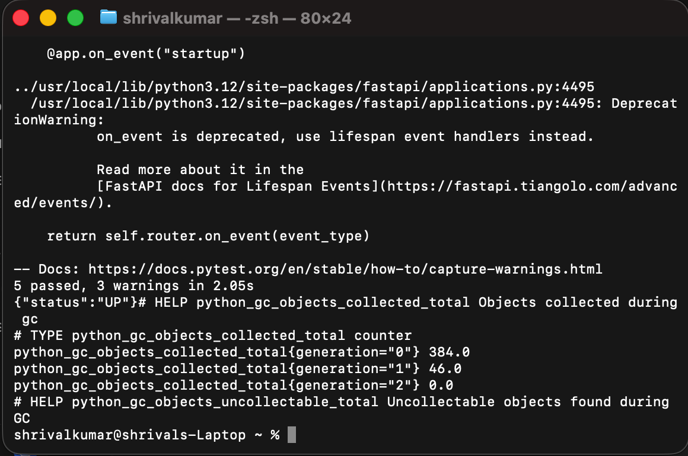
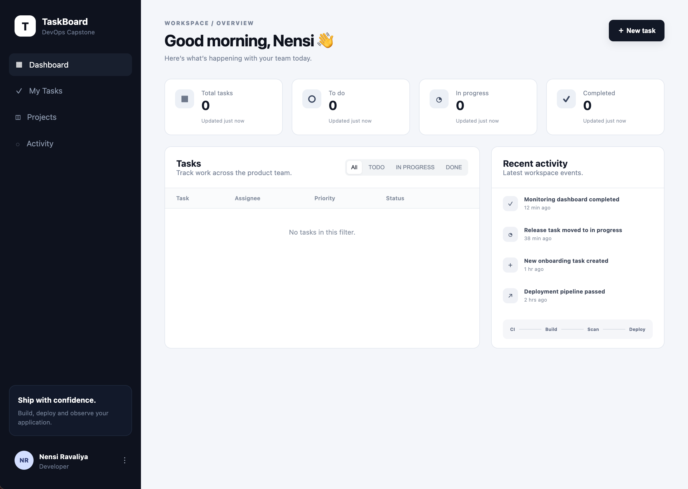
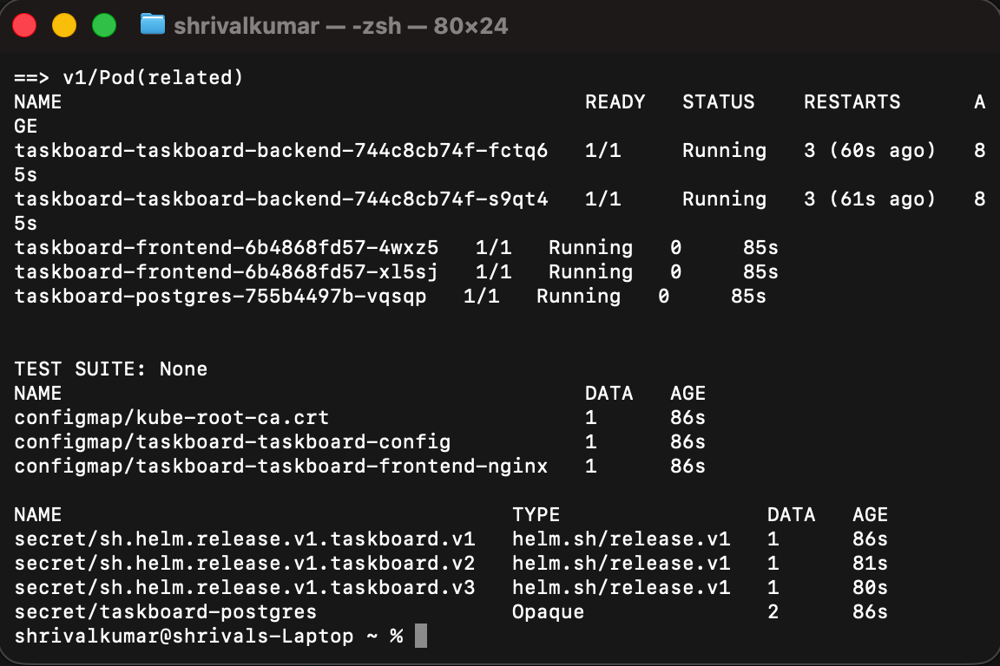

# TaskBoard — final DevOps project

I built TaskBoard as my end-to-end DevOps capstone. It is a FastAPI and React task tracker, but I treated it like a production delivery exercise: I tested it, containerised it, scanned it, deployed it with Helm, exposed metrics, and defined a GitOps hand-off.

## Architecture

```text
Developer commit -> GitHub Actions -> test/security gates -> Docker images -> GHCR
       |                                                            |
Terraform (AWS VPC + EKS plan)                         Helm -> Kubernetes
                                                                    |
                     Frontend -> FastAPI API -> PostgreSQL PVC <- ConfigMap/Secret
                                            |
                                health, readiness, metrics -> Prometheus/Grafana
                                            |
                                   Argo CD reconciles desired Git state
```

The application code is in `backend/` and `frontend/`. `docker-compose.yml` is my local environment. `helm/taskboard/` creates the API and frontend Deployments and Services, PostgreSQL Secret, ConfigMaps, PVC, probes, optional Ingress, optional HPA, and ServiceMonitor.

## Tools used

Python/FastAPI, React/Vite, PostgreSQL, Docker Compose, Kubernetes, Helm, Terraform, GitHub Actions, Bandit, pip-audit, Gitleaks, Trivy, Prometheus/Grafana, and Argo CD.

## Docker and application checks

I added a PostgreSQL health check and made the API wait for it before its Alembic migration. That fixed a real startup race I found while testing.

```bash
docker compose up --build -d
docker compose ps
docker compose exec -T backend pytest -q
curl http://localhost:8000/health
curl http://localhost:8000/metrics
docker compose down -v
```

My final container test run passed all five API tests. The API health endpoint returned `{"status":"UP"}` and `/metrics` returned Prometheus-formatted data.

## Kubernetes and Helm

For a safe validation run, I used a temporary Kind cluster rather than provisioning a paid cloud cluster. I loaded the local images, deployed the chart, and verified traffic through the frontend service.

```bash
kind create cluster --name final-devops --config kind-final-devops.yaml
kind load docker-image session21-python-backend:latest --name final-devops
kind load docker-image session21-python-frontend:latest --name final-devops
helm upgrade --install taskboard helm/taskboard -n taskboard --create-namespace \
  -f helm/taskboard/values-gitops.yaml
kubectl -n taskboard get deployments,pods,services,pvc,configmap,secret
kubectl -n taskboard port-forward service/taskboard-frontend 8088:80
curl http://127.0.0.1:8088/api/tasks
curl http://127.0.0.1:8088/health
```

The live validation reached a healthy frontend (2/2), API (2/2), and PostgreSQL (1/1). The PostgreSQL PVC was bound, and I received `[]` from the API and `{"status":"UP"}` through the frontend proxy.

The normal chart keeps HPA and ServiceMonitor enabled for a monitored cluster. I disabled them only in `values-gitops.yaml` because my small Kind validation cluster has neither the Prometheus CRDs nor metrics server.

## Terraform infrastructure

`terraform/` contains the AWS VPC and EKS definition, variables, outputs, and module configuration. I did not run `terraform apply`: EKS and NAT Gateway can create AWS charges. Terraform is not installed in this workspace, so I left the validation commands below as the safe next step on a machine with Terraform installed.

```bash
cd terraform
terraform init
terraform fmt -recursive
terraform validate
terraform plan
# Run terraform apply only with an approved lab budget.
# Always run terraform destroy when the lab ends.
```

Terraform state tracks the resources it creates, so the same configuration can be planned safely and later destroyed as a unit.

## CI/CD and DevSecOps

The active workflow is [session21-final-devops.yml](../.github/workflows/session21-final-devops.yml). It runs from the repository root when this project changes.

1. It installs the API dependencies, runs the five pytest checks, and builds the React client.
2. It runs Bandit (SAST), pip-audit (SCA), Gitleaks (secret scan), and Trivy configuration scanning.
3. Once those gates pass, it builds both images, scans the backend image with Trivy, and pushes SHA-tagged images to GHCR.
4. When the protected `KUBE_CONFIG_DATA` secret is available, it deploys with Helm using those immutable tags.

I keep credentials out of Git. The workflow uses GitHub's short-lived `GITHUB_TOKEN` for GHCR and reads the kubeconfig only from a repository secret.

## Monitoring, observability, and GitOps

I exposed `/health`, `/ready`, and `/metrics`. Health and readiness probes let Kubernetes decide when to restart an API pod or route traffic to it. The ServiceMonitor template tells Prometheus where to scrape every 15 seconds, and `monitoring/prometheus-values.yaml` is the starting configuration for kube-prometheus-stack.

For me, observability combines metrics (rates and CPU/memory trends), logs (events and errors), and traces (a request path across services). I would alert on unavailable replicas, failed readiness checks, high error rates, database connection errors, and sustained CPU pressure.

`gitops/argocd-application.yaml` is my Argo CD hand-off. Git is the source of truth: Argo CD watches the Helm chart on `main`, compares the desired state with the cluster, and corrects drift. Before using it in a shared cluster, I replace the local Kind image values with immutable GHCR tags.

```bash
kubectl apply -f gitops/argocd-application.yaml
kubectl -n argocd get applications.argoproj.io taskboard
```

## Troubleshooting

I kept deliberate broken-image and broken-service manifests in `troubleshooting/`, with investigation notes in [troubleshooting/README.md](troubleshooting/README.md). During the real cluster validation I also found that the frontend Nginx file used Compose's `backend` hostname. I replaced it with a Helm-managed Nginx ConfigMap that targets the Kubernetes API Service. After the Helm upgrade, the frontend was 2/2 ready and service traffic worked.

## Evidence and lessons learned

The exact commands used for my terminal evidence are stored in `evidence/`; their output came from the live Docker and Kind validation, not mocked output.

### Docker tests, health, and metrics



I ran the API tests inside the backend container, then checked the health endpoint and the first Prometheus metric lines.

### Running TaskBoard application



This is the TaskBoard dashboard served by the Docker Compose frontend after the API and database were running.

### Helm release and Kubernetes resources



This capture shows two API replicas, two frontend replicas, and PostgreSQL running after the Helm release. It also shows the Helm-managed ConfigMaps and PostgreSQL Secret.

I learned that a pipeline is only one part of deployment: service discovery, readiness, image availability, secrets, storage, and reconciliation must all line up.

I remove temporary lab resources when finished:

```bash
docker compose down -v
kind delete cluster --name final-devops
```
