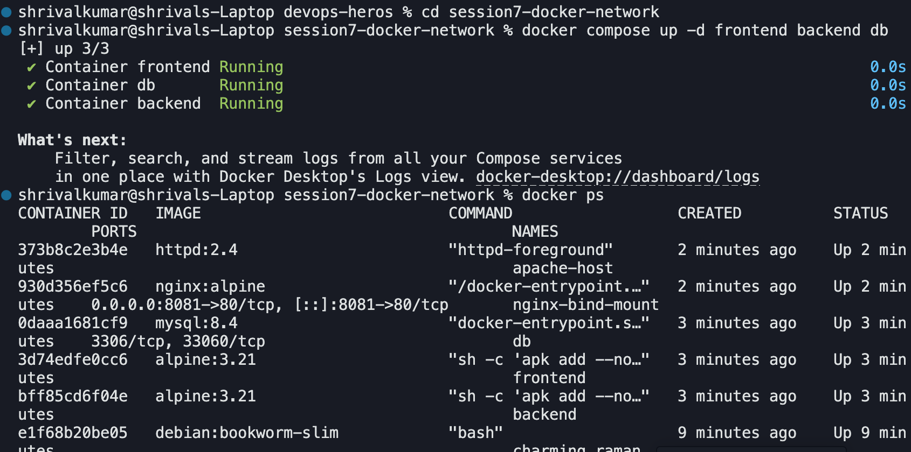
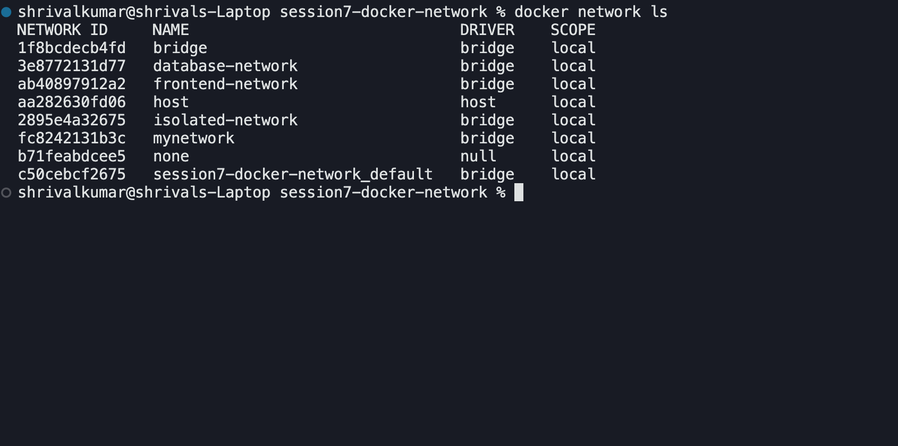
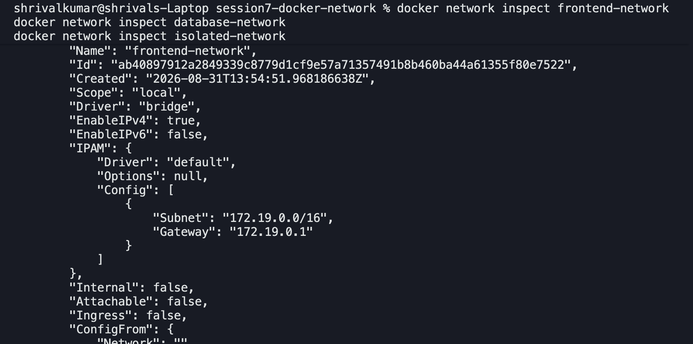
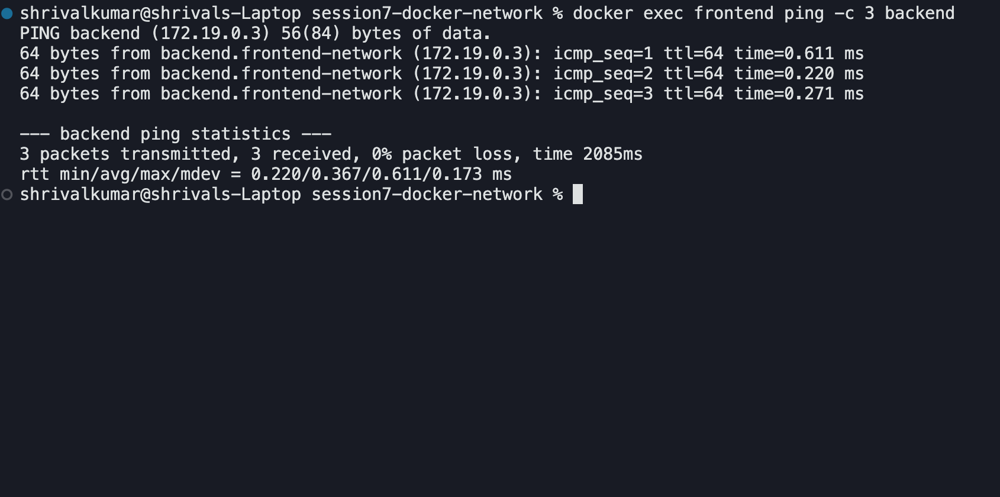
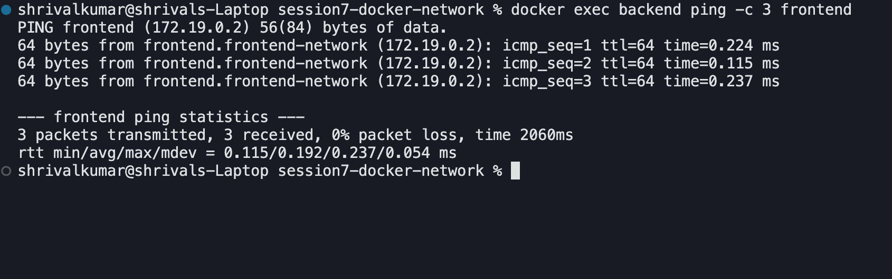
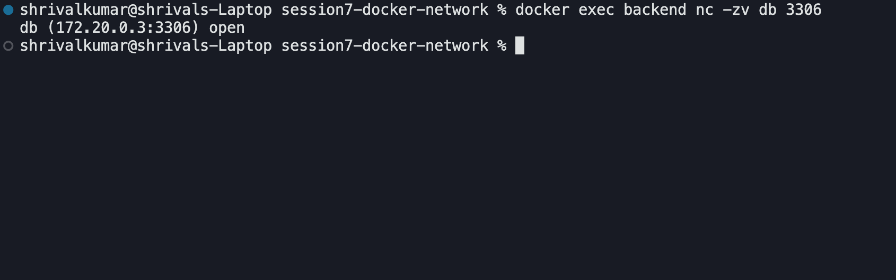
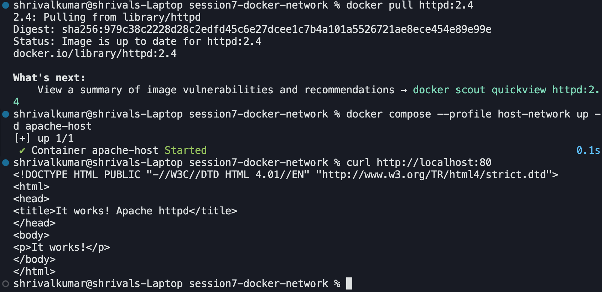
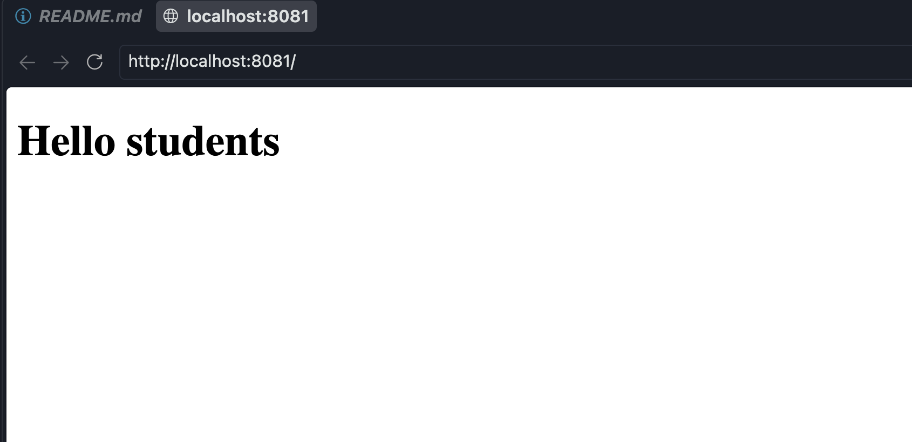

## Screenshots

### Containers running

### Three networks

### Network inspection

### Frontend to backend connectivity

### Backend to frontend connectivity

### Backend to database connectivity

### Frontend cannot reach database

### Apache using host network

### nginx bind mount

